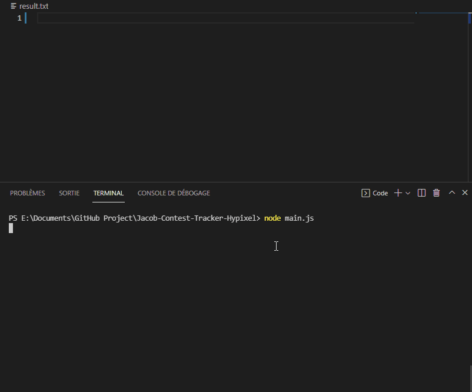

<h1 align="center">Jacob Contest Tracker on Hypixel</h1>
<div align="center">

<p>(An example of the script running without error (speed up from 20 seconds to 8 seconds))</p>
</div>


# What is this repo for ?
This repo contains javascript file to extract every Jacob's contest on Hypixel Skyblock.

## How it works
Using node.js and mineflayer package.
The bot is able to connect on mc.hypixel.net:25565, join Skyblock mode, open the in-game calendar and extract every Jacob's contest.


## How to run it
First you need to install Node.js.
One Node.js is installed run main.js using
```bash
node main.js
```
Wait for several seconds/minutes (depending on your connection).
You can follow the execution in the terminal.
When the script is done, you can find the result in the file result.csv next to main.js file

## Result
The resulat is a csv file using ; as separator, it follows this pattern: 
[INGAMEDAY];[TIME_SINCE_EPOCH];[CROPS_1];[CROPS_2];[CROPS_3];

## How it collects the data
First the bot connect to Hypixel IP which is mc.hypixel.net:25565.
When he is connected, he will wait at least 10 seconds, when the script catch a message the bot run '/skyblock' to join obviously skyblock.
This technique is a way to not spam Hypixel server with command when it didn't join skyblock at first time.

Now the second main step is to open the in-game calendar. To do so we just as before wait for the in-game message 'Welcome to Skyblock!' send by the server single everytime you joined Skyblock. Then the bot type /calendar to open a GUI that you may know.
Then the script is looping into every item in the GUI and looking for a 'minecraft:clock' and click on it to more detailled calendar.
Like before, the script just go throught every item and get information about there such as Item Name and Item Lore which contain information about the Jacob's contest.
Et voilà! We just have to save it into a file : result.txt
When no more page is found, that means we have reach the end of the year so we can leaved the server.


Because there is no way to get Jacob's contest event throught Hypixel API.
I have made a bot which analyse in-game GUI especially Item Name and Item Lore.
The Item Lore contains the list of crops for the contest.

